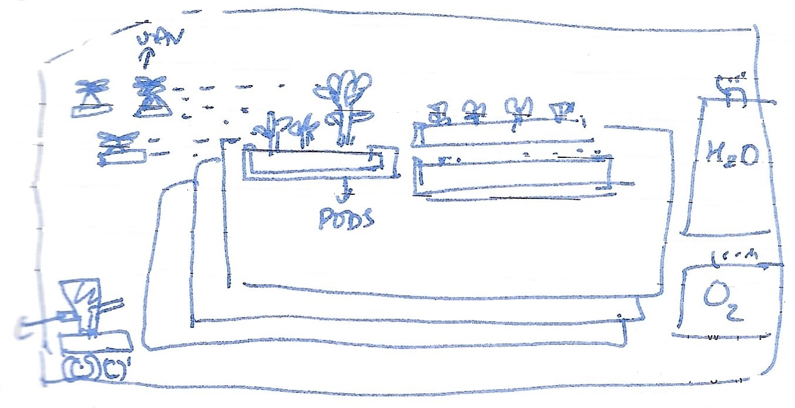

### Hi there 👋 🧙 👩‍💻 

* We are building <a href="https://mangala.earth">ಭೂಮಿ / Bhoomi </a> 

###  Bhoomi
is an Autonomous Habitat designed for long term exploration on Mars.

Bhoomi can be visualised as Internation Space Station on Mars, but designed with robots and human to complement 
work and exploration

Robots would set up the entire system, growing food and maintaining the habitat
before the first astronauts arrive at Mars.

Robots will be sent earlier than Humans due to low-cost Rockets compared to human-rated systems.

Poster presented at [SSEO-14](www.dlr.de/sseo14) - Berlin - 10 May 2022
 

