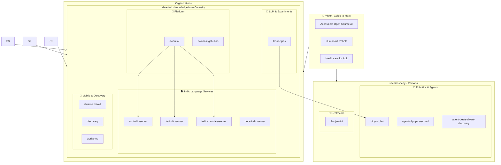

# building dwani.ai

> Knowledge from Curiosity | Day 2 on Mars

## About

Building accessible, private, and open-source AI solutions for Indian languages and robotics applications. Focused on multimodal inference, voice-based coding, and sustainable robotics.

## Core Projects

### 🌟 dwani.ai Platform
- **[dwani.ai](https://dwani.ai/)** - Multimodal Inference for Indian Languages
  - Main platform providing AI inference capabilities
  - Website: [dwani-ai.github.io](https://github.com/dwani-ai/dwani-ai.github.io)

### 🔬 LLM Recipes & Experiments
- **[llm-recipes](https://github.com/dwani-ai/llm-recipes)** ⭐ 42 stars
  - Experiments with GenAI - Multimodal
  - Tools required for Robots
  - Website: [slabstech.com/llm-recipes](https://slabstech.com/llm-recipes/)

### 🗣️ Indic Language Services
- **[asr-indic-server](https://github.com/dwani-ai/asr-indic-server)** - Automatic Speech Recognition for Indian languages
- **[tts-indic-server](https://github.com/dwani-ai/tts-indic-server)** - Text-to-Speech for Indian languages
- **[indic-translate-server](https://github.com/dwani-ai/indic-translate-server)** - Translation services for Indian languages
- **[docs-indic-server](https://github.com/dwani-ai/docs-indic-server)** - Documentation server

### 📱 Mobile & Discovery
- **[dwani-android](https://github.com/dwani-ai/dwani-android)** - Android application for dwani.ai
- **[discovery](https://github.com/dwani-ai/discovery)** - Discovery platform
- **[workshop](https://github.com/dwani-ai/workshop)** - Workshop materials and resources

### 🤖 Robotics & Agents
- **[biryani_bot](https://github.com/sachinsshetty/biryani_bot)** - Make delicious Biryani with Robot
- **[agent-olympics-school](https://github.com/sachinsshetty/agent-olympics-school)** - Agent Olympics school project
- **[agent-beats-dwani-discovery](https://github.com/sachinsshetty/agent-beats-dwani-discovery)** - Agent beats discovery project

### 🏥 Healthcare
- **[Sanjeevini](https://sanjeevini.me)** - AI Healthcare App

## Strategy

Open source community collaboration with cutting-edge methods, focusing on:
- Accessible, Private and Open Source AI for ALL
- Humanoid Robots at Warehouse
- Healthcare for ALL

## Project Map

```mermaid
flowchart TB
    subgraph Vision["🎯 Vision: Guide to Mars"]
        V1[Accessible Open Source AI]
        V2[Humanoid Robots]
        V3[Healthcare for ALL]
    end

    subgraph Orgs["Organizations"]
        subgraph dwani["dwani-ai · Knowledge from Curiosity"]
            subgraph platform["🌟 Platform"]
                P1[dwani.ai]
                P2[dwani-ai.github.io]
            end
            subgraph llm["🔬 LLM & Experiments"]
                L1[llm-recipes]
            end
            subgraph indic["🗣️ Indic Language Services"]
                I1[asr-indic-server]
                I2[tts-indic-server]
                I3[indic-translate-server]
                I4[docs-indic-server]
            end
            subgraph mobile["📱 Mobile & Discovery"]
                M1[dwani-android]
                M2[discovery]
                M3[workshop]
            end
        end
    end

    subgraph personal["sachinsshetty · Personal"]
        subgraph robotics["🤖 Robotics & Agents"]
            R1[biryani_bot]
            R2[agent-olympics-school]
            R3[agent-beats-dwani-discovery]
        end
        subgraph health["🏥 Healthcare"]
            H1[Sanjeevini]
        end
    end

    Vision --> Orgs
    Vision --> personal
    P1 --> I1 & I2 & I3
    L1 --> R1
    S1 & S2 & S3 --> dwani
```

---

*Building the future of accessible AI, one commit at a time.* 🚀
