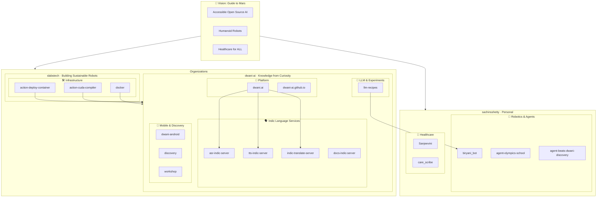
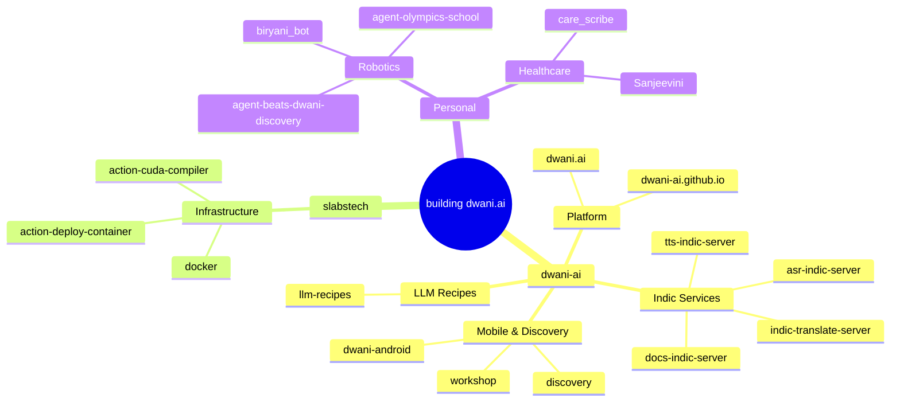
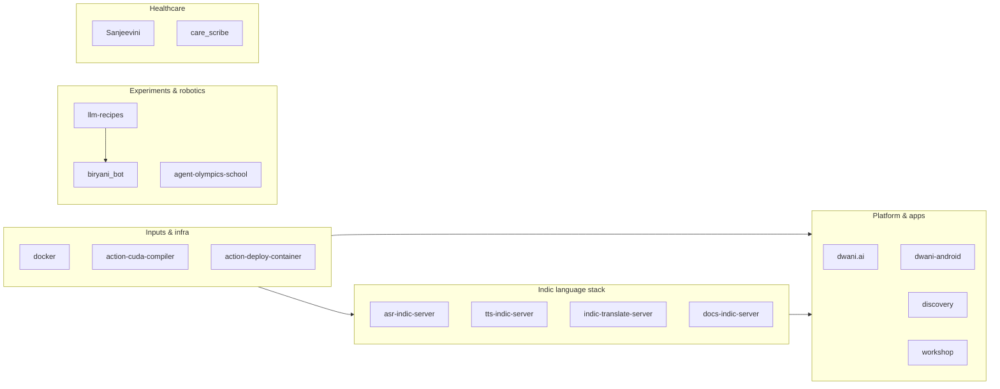
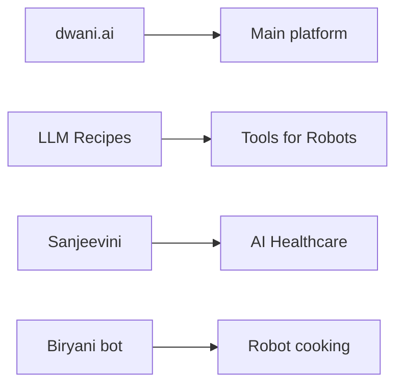

# Project Map

Mermaid diagrams mapping [sachinsshetty](https://github.com/sachinsshetty) projects and how they connect.

## High-level: Vision → Organizations → Projects

## By category (mindmap style)

## Dependency / flow view

## Priority projects (top 4)

